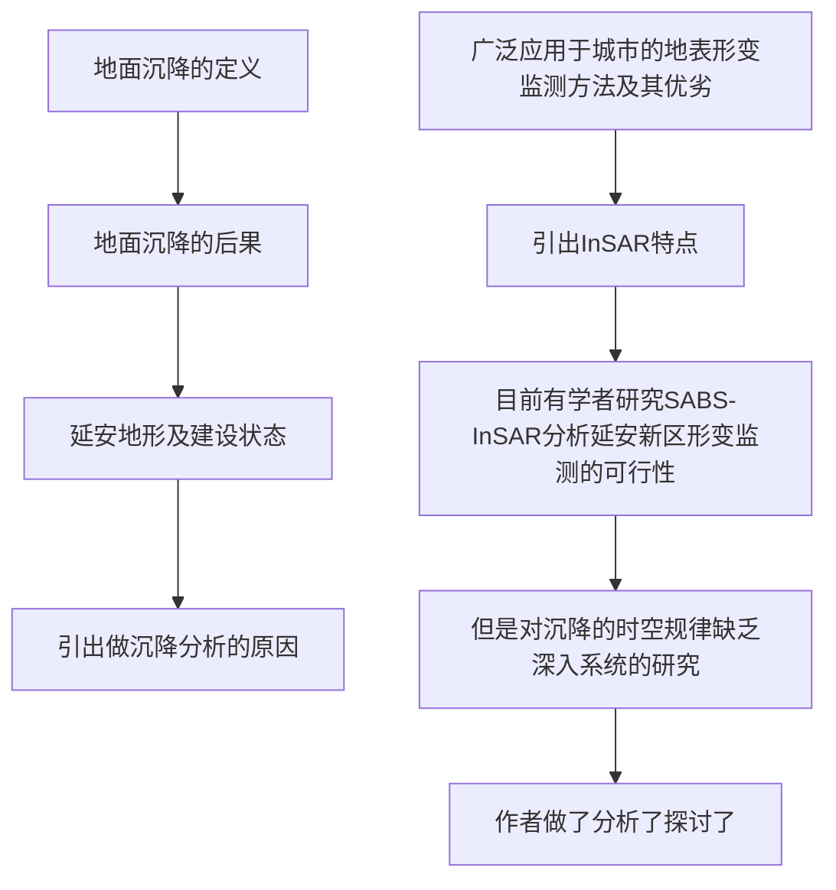

# 延安新区地面沉降时空演化特征时序 InSAR 监测与分析

### 0 摘要：
延安新区以其规模巨大的平山造城工程而备受关注，其快速的工程建设及复杂的地质条件导致了广
泛的地面沉降。利用小基线集合成孔径雷达干涉测量（small baseline subset interferometric synthetic aperture
radar，SBAS⁃InSAR）技术对 2016⁃05—2019⁃10 期间获取的升轨 Sentinel⁃1A 数据进行处理，分析了延安新区工
后地面沉降时空演化特征，探讨了其沉降机理及演化趋势。结果表明，新区的地面沉降区随造地工程由城区
向林区发展，其面积随时间总体呈衰减趋势；地面沉降的时间演化经历快速、减缓、平稳 3 个过程，填方体厚度
越大，其累计沉降量越大，沉降稳定所需时间越长。地面沉降主要为填方体自身的固结压缩变形，可分为瞬时
沉降、固结沉降、次固结沉降 3 个阶段，依据不同阶段的特征并结合时序形变，可以对新区的地面沉降过程及
其发展趋势进行分析。研究结果可为新区进一步开展沉降监测预警、城市规划建设及灾害防控提供科学的参
考依据。

### 1 方法：
小基线集合成孔径雷达干涉测量（small baseline subset interferometric synthetic aperture radar，SBAS⁃InSAR）

### 2 数据: 
2016⁃05—2019⁃10 升轨 Sentinel⁃1A 数据
SRTM数据 
ZY-3 DEM 数据（5m  2017-10-13）
Google earth 影像

### 3 分析目标
分析了延安新区工
后地面沉降时空演化特征，探讨了其沉降机理及演化趋势

### 4 结论：
地面沉降区随造地工程由城区
向林区发展，其面积随时间总体呈衰减趋势；地面沉降的时间演化经历快速、减缓、平稳 3 个过程，填方体厚度
越大，其累计沉降量越大，沉降稳定所需时间越长。地面沉降主要为填方体自身的固结压缩变形，可分为**瞬时
沉降、固结沉降、次固结沉降** 3 个阶段，依据不同阶段的特征并结合时序形变，可以对新区的地面沉降过程及
其发展趋势进行分析。

## 1.1 具体方法

把影像分成4组分别进行InSAR处理：减小失相干的影响
用SRTM去除地形起伏的影响
用ZY-3提取的2017年DEM作为工后地形数据：分析典型区域地面沉降和填方体厚度的关系

## 论文写作结构

### 引言

